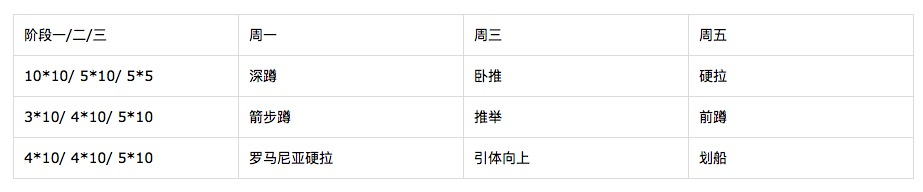

# 制定计划

## 训练期的注意点
1. 训练前后都喝蛋白粉；非训练日则在午餐前喝1次
2. 热身后，复合动作复习；然后按 复合动作(1个) -> 辅助动作(2~4个) -> 专项动作 顺序训练
3. 当日训练动作都完成后，拉伸 @TODO
4. 拉伸后，过几分钟洗澡；不洗澡则擦干汗液。然后补餐。

## 计划

* 每8周升阶；从阶段一开始，到阶段三后循环
* 每阶开启时，重新测量 各个动作的 单次最大重量 ，各阶段每个动作的重量如下
     * 阶段一：40%*单次最大重量
     * 阶段二：50%*单次最大重量
     * 阶段三：80%*单次最大重量
* 加重原则 （动作规范 > 动作次数 > 重量）
     * 动作不标准，不增加重量
     * 加重频率见各阶段的调整
     

### 阶段一的调整
##### 加重原则的调整（动作规范 > 动作次数 > 重量）
* 每周增加 2~2.5 kg
* 当遇到加重后不能一次完成一组的情况，下面二选一
	* 短暂休息10s或者 hold住，然后完成该组剩余次数，每组的中断次数不超过1次
	* 减少重量，完成次数即可

### 阶段二的调整
##### 计划的调整
* A周
	* 深蹲不变
	* 卧推不变
	* 硬拉变重按 30% 40% 50% 60% 50%
* B周	
	* 深蹲变重按 30% 40% 50% 60% 50%
	* 卧推变重按 40% 45% 50% 55% 55%
	* 硬拉不变

##### 加重原则的调整（动作规范 > 动作次数 > 重量）
* 当重量过大完成不了，配置可减10%，但提高次数(为了保证运动量)
	1. 卧推 50% * 5 * 10 = 2500% 完成不了
	2. 可换成 45% * 5 * 11
		* 2500% / 45% = 总次数55 = 5 * 11
	3. 或者 40% * 5 * 13
		* 2500% / 40% = 63 = 5 * 13

### 阶段三的调整 @TODO

## 卧推增强计划
以下步骤在每次训练热身完毕后执行（不管当天是否进行卧推）：
1. 卧推热身
	* 空杆10次，快速，下半程
	* 30% 6次
	* 40% 5次
2. 热身后马上进行卧推 50% 3 * 12

